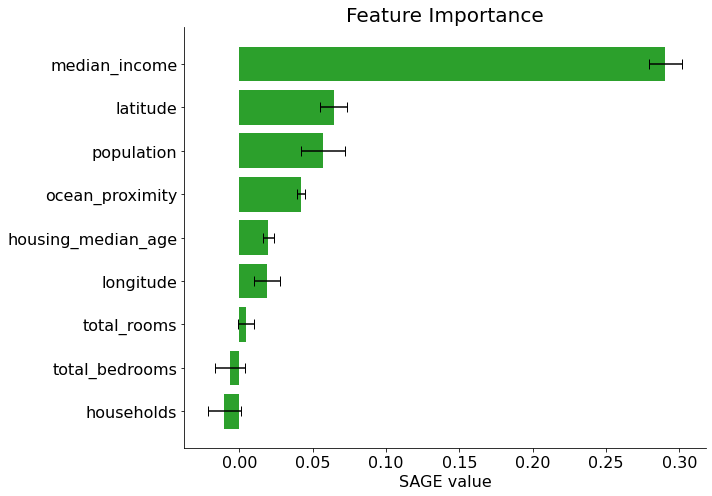
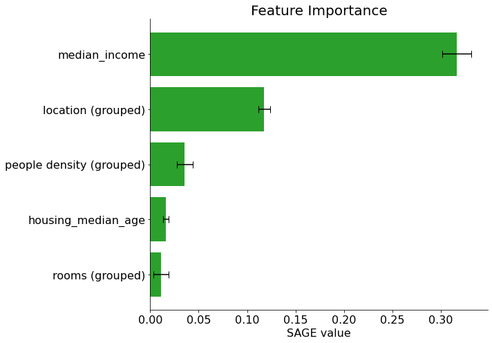

# Reproducible Deep Learning
## Extra: Model Explainability via Global Feature Importance using SAGE
### Authors: [Andrea Mastropietro](https://github.com/AndMastro), [Maria Sofia Bucarelli](https://github.com/memis12)

[[Official website](https://www.sscardapane.it/teaching/reproducibledl/)]

> :warning: **extra** branches implement additional exercises created by the students of the course to explore additional libraries and functionalities. They can be read independently from the main branches. Refer to the original authors for more information.

&nbsp;

## Overview
A well trained neural network is able to deliver good predictive performances. However, in certain fields we are interested to know which are the input features that mostly contribute to the output prediction. There are two approaches to **explainability**:

* Local: given an input instance, we measure the impact on the output of the features for that very instance.
* Global: we measure the overall impact (dataset-wise) of the features on the model performances.

The latter is the goal of **SAGE**. Explaining a prediction can be fundamental in order to both prodive meaningful insights on what the network learned and for debugging and inspection purposes.

SAGE uses Shapley values from game theory to compute global feature importance scores. It differentiates in this from other methods (SHAP, Integrated Gradients, etc...) since the latter provide sample-wise explanations rather then dataset-wise.

The original **SAGE** paper can be found [here](https://arxiv.org/abs/2004.00668).\
The related github repository is [here](https://github.com/iancovert/sage/).

&nbsp;

## Requirements
In order to run the example [notebook](train_explain.ipynb), you need the following:

1. Follow the setup instructions from the `main` branch.
2. Download the Carifornia Housing Prices dataset inside the `data` folder from here: https://www.kaggle.com/camnugent/california-housing-prices.\
Alternatively, one can use the Kaggle API:

    ```bash 
    kaggle datasets download -d camnugent/california-housing-prices
    ```
    
3. Install `sage-importance` package using `pip`:
    ```bash
    pip install sage-importance
    ```

&nbsp;

## Individual Feature Importance
Using SAGE we can compute feature importance both considering each feature indepentendly or group them together. You can train your favourite model (SAGE is model-agnostic) and then compute global explanations. What you need to do is to define an `imputer`, which is used to handle missing features, if they occur, and then run a Shapley value estimator that will compute feature importance: 

```python
import sage

# get your data
x_test, y_test = ...
feature_names = ...

# train your favourite model 
model = ...

# set up an imputer to handle missing features
imputer = sage.MarginalImputer(model, x_test[:512])

# set up an estimator for Shapley values computation
estimator = sage.PermutationEstimator(imputer, 'mse')

# calculate SAGE values
sage_values = estimator(x_test, y_test)

# plot the results
sage_values.plot(feature_names)
```

Here is an example of a feature importance plot from the notebook case study:



&nbsp;

## Grouped Feature Importance
As stated, we can coalesce features into groups in order to compute their joint importance for the model. Here follows an example from the notebook provided:

```python
# we create feature groups we may be interested in
feature_groups = group_names = {
    'location (grouped)': ['longitude', 'latitude', 'ocean_proximity'],
    'rooms (grouped)': ['total_rooms', 'total_bedrooms'],
    'people density (grouped)': ['population', 'households'],
    'median_income': ['median_income'],
    'housing_median_age': ['housing_median_age']
}

group_names = list(feature_groups.keys())


# group indices
groups = []
for _, group in feature_groups.items():
    ind_list = []
    for feature in group:
        ind_list.append(feature_names.index(feature))
    groups.append(ind_list)
```

The Shapley values computation is analogous as for the individual features case, we just need to pass the group indices to the `imputer`:

```python
imputer = sage.GroupedMarginalImputer(net, X_test[:512], groups)
estimator = sage.PermutationEstimator(imputer, 'mse')
sage_values = estimator(X_test, y_test)

sage_values.plot(group_names)
```
The grouped feature importance plot will look like that:



&nbsp;

For a complete example usage, from data processing to model definition, training and explaination, refer to this [notebook](train_explain.ipynb)
