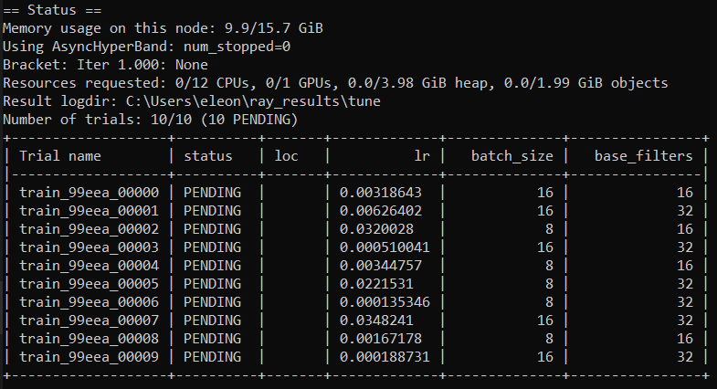

# Reproducible Deep Learning

## Extra: Ray Tune for distributed hyperparameter tuning

### Authors: [Eleonora Grassucci](https://github.com/eleGAN23), [Valerio Guarrasi](https://github.com/guarrasi1995), [Andrea Marcocchia](https://github.com/andremarco)

[[Official reprodl website]](https://www.sscardapane.it/teaching/reproducibledl/)

Ray Tune is a tool for hyperparameters tuning in a local or distributed fashion. It is integrated in TensorBoard and easy to add in a PyTorch code.

### Local set-up
As reported in the [documentation](https://docs.ray.io/en/latest/installation.html), Ray fully supports MacOS and Linux. Windows requires Visual C++ dependencies, check it [here](https://docs.ray.io/en/latest/installation.html#windows-support). 

To install Ray Tune follow:

```bash
pip install -U ray
```

In your code, add imports.

```python
from ray import tune
from ray.tune import CLIReporter
from ray.tune.schedulers import ASHAScheduler
```

The information passing between your model and Tune is performed by the `tune.report` method.
Here an example of validation loss and accuracy:

```python
tune.report(loss=validation_loss, accuracy=val_acc)
```

If using PyTorch Lightning, Ray Tune exploits the [Callbacks](https://pytorch-lightning.readthedocs.io/en/latest/callbacks.html) methods from the framework and build the `TuneReportCallback`. When defining the PyTorch Lightning (`pl`) Trainer, you can specificy `TuneReportCallback` as callback:

```python
trainer = pl.Trainer(max_epochs=1, gpus=0, progress_bar_refresh_rate=0,
                         callbacks=[TuneReportCallback({"val_acc": "val_acc"}, on="validation_end")])
```

The callback takes the validation accuracy `val_acc` from the PyTorch Lightning Trainer and reports it to Tune.

The hyperparameter grid is a Python dictionary:

```python
config = {"lr": tune.loguniform(1e-4, 1e-1),
          "batch_size": tune.choice([32, 64])}
```

Finally, the search is performed through `tune.run` in which it is possible to specify the resources allocated to perform the search.

```python
result = tune.run(
    partial(train_cifar, data_dir=data_dir),
    resources_per_trial={"cpu": 8, "gpu": 2},
    config=config,
    num_samples=num_samples,
    scheduler=scheduler,
    progress_reporter=reporter,
    checkpoint_at_end=True)
```

During training, if TensorBoard is installed, hyperparameters are automatically tracked and visualized in TensorBoard:

```bash
tensorboard --logdir ~/ray_results
```

A sample output of Ray Tune while training the net in `train.py`:


